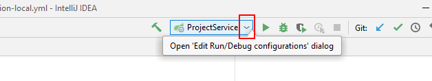
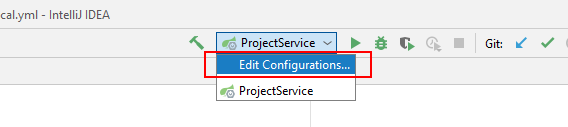
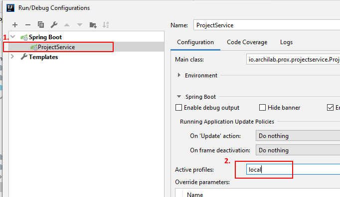
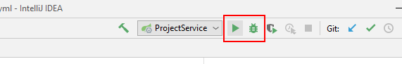

# PTB Local setup
This repository contains the instruction how to start the prox (Project Exchange TH Köln) on your local machine.

### Table of contents
* [System requirements](#system-requirements)
* [Get the sources](#get-the-sources)
* [Run in Docker](#run-in-docker)
* [Run/Debug in IntelliJ IDEA](#rundebug-in-intellij-idea)

## System requirements
This section describe the system requirements for the prox-* projects.

- [Maven](https://maven.apache.org/)
- [NodeJs](https://nodejs.org/en/)
- [Docker](https://docs.docker.com/)
- [Java 8 JDK (Java SE Development Kit 8uXXX reicht!)](https://www.oracle.com/technetwork/java/javase/downloads/jdk8-downloads-2133151.html)
- [Git](https://git-scm.com/download)
- IntelliJ/Eclipse (Optional)

### Verify
To verify that the programs correctly installed and configured, execute the following commands on your command line/bash and verify that you get outputs as like as the following (versions can be different!).

Maven
``` posh
> mvn --version
Apache Maven 3.5.0 (ff8f5e7444045639af65f6095c62210b5713f426; 2017-04-03T21:39:06+02:00)
Maven home: E:\maven\bin\..
Java version: 1.8.0_144, vendor: Oracle Corporation
Java home: C:\Program Files\Java\jdk1.8.0_144\jre
Default locale: de_DE, platform encoding: Cp1252
OS name: "windows 10", version: "10.0", arch: "amd64", family: "windows"
```

NodeJs
``` posh
> node --version
v10.12.0
```

Docker
``` posh
> docker --version
Docker version 18.09.2, build 6247962
```

Java
``` posh
> java -version
java version "1.8.0_144"
Java(TM) SE Runtime Environment (build 1.8.0_144-b01)
Java HotSpot(TM) 64-Bit Server VM (build 25.144-b01, mixed mode)
```

Git
``` posh
> git --version
git version 2.21.0.windows.1
```

## Get the sources
Create a root project folder

``` posh
> mkdir ArchiLab
> cd ArchiLab/
```

Clone the following repositories into the `ArchiLab` folder:
- [prox-project-service](https://github.com/Archi-Lab/prox-project-service)
- [prox-module-service](https://github.com/Archi-Lab/prox-module-service)
- [prox-web-client](https://github.com/Archi-Lab/prox-web-client)
- [prox-service-discovery](https://github.com/Archi-Lab/prox-service-discovery)
- [prox-api-gateway](https://github.com/Archi-Lab/prox-api-gateway)


Copy&Paste ready for the `master` branch (PowerShell)
``` posh
> git clone https://github.com/Archi-Lab/prox-project-service.git; `
git clone https://github.com/Archi-Lab/prox-module-service.git; `
git clone https://github.com/Archi-Lab/prox-web-client.git; `
git clone https://github.com/Archi-Lab/prox-service-discovery.git; `
git clone https://github.com/Archi-Lab/prox-api-gateway.git
```

Copy&Paste ready for the `dev` branch (Powershell)
``` posh
> git clone https://github.com/Archi-Lab/prox-project-service.git; cd prox-project-service/; git checkout dev; cd ..; `
git clone https://github.com/Archi-Lab/prox-module-service.git; cd prox-module-service/; git checkout dev; cd ..; `
git clone https://github.com/Archi-Lab/prox-web-client.git; cd prox-web-client/; git checkout dev; cd..; `
git clone https://github.com/Archi-Lab/prox-service-discovery.git; cd prox-service-discovery/; git checkout dev; cd ..; `
git clone https://github.com/Archi-Lab/prox-api-gateway.git; cd prox-api-gateway/; git checkout dev; cd ..
```

Copy&Paste ready for the `master` branch (for bash)
``` posh
> git clone https://github.com/Archi-Lab/prox-project-service.git &&
git clone https://github.com/Archi-Lab/prox-module-service.git &&
git clone https://github.com/Archi-Lab/prox-web-client.git &&
git clone https://github.com/Archi-Lab/prox-service-discovery.git &&
git clone https://github.com/Archi-Lab/prox-api-gateway.git
```
Copy&Paste ready for the `dev` branch (for bash)
``` posh
> git clone https://github.com/Archi-Lab/prox-project-service.git && cd prox-project-service/ && git checkout dev && cd .. &&
git clone https://github.com/Archi-Lab/prox-module-service.git && cd prox-module-service/ && git checkout dev && cd .. &&
git clone https://github.com/Archi-Lab/prox-web-client.git && cd prox-web-client/ && git checkout dev && cd .. && 
git clone https://github.com/Archi-Lab/prox-service-discovery.git && cd prox-service-discovery/ && git checkout dev && cd .. &&
git clone https://github.com/Archi-Lab/prox-api-gateway.git && cd prox-api-gateway/ && git checkout dev && cd ..
```


## Run in Docker
This chapter describe how to run locally a copy of the prox environment. In this step we use the last version of the images.

### You have an account on https://nexus.archi-lab.io/
Login with docker on our registry.

``` posh
> docker login -u "your_username" -p "your_password" docker.nexus.archi-lab.io
```

Now continue with the **Start local environment** section.

### You don't have an account (work only locally)
You have to build the docker images into your local registry. Please go into each `prox-*` folder/project you checked out except prox-web-client and follow the **Installation** instructions in the README.md.

Then continue with these instructions.

### Start locally 

Create a new docker network for prox
``` posh
> docker network create prox
```

Start the service discovery
``` posh
> cd prox-service-discovery/
> docker-compose -f docker-compose-service-discovery.yml up
```

Start the API-Gateway
``` posh
> cd prox-api-gateway/
> docker-compose -f docker-compose-api-gateway.yml up
```

Start the module service
``` posh
> cd prox-module-service/
> docker-compose -f docker-compose-module-service.yml up
```

**Hint:** If you start the module service for the first time, you have to wait for the following output in the log before you start the project service (It can take up to 10 min.):
```
2019-07-17 11:49:54.968  INFO 1 --- [nio-9001-exec-1] o.s.web.servlet.DispatcherServlet        : Completed initialization in 135 ms
```

Start the project service
``` posh
> cd prox-project-service/
> docker-compose -f docker-compose-project-service.yml up
```

Start the web-client
``` posh
> cd prox-web-client/
> npm install
> npm install -g @angular/cli@7.1.4 --unsafe
> ng serve
** Angular Live Development Server is listening on localhost:4200, open your browser on http://localhost:4200/ **

Date: 2019-05-17T13:07:29.227Z
Hash: 92d2835e8f05b47a93dd
Time: 36281ms
chunk {main} main.js, main.js.map (main) 530 kB [initial] [rendered]
chunk {polyfills} polyfills.js, polyfills.js.map (polyfills) 237 kB [initial] [rendered]
chunk {runtime} runtime.js, runtime.js.map (runtime) 6.08 kB [entry] [rendered]
chunk {styles} styles.js, styles.js.map (styles) 179 kB [initial] [rendered]
chunk {vendor} vendor.js, vendor.js.map (vendor) 7.17 MB [initial] [rendered]
i ｢wdm｣: Compiled successfully.
```

Finally open your browser on http://localhost:4200

## Run/Debug in IntelliJ IDEA
This chapter describe how to debug/run locally in IntelliJ IDEA a copy of the prox environment.

First you have to set `local` as active profile in IntelliJ IDEA for the following projects:
- prox-project-service
- prox-api-gateway
- prox-module-service

For the other projects, nothing needs to be adjusted.

### Configure active profile in IntelliJ IDEA
- Open the projects mentioned above in IntelliJ IDEA and wait a moment until IntelliJ loaded the project. After that click on the arrow in the configuration combobox and than on **Edit Configurations...**


- Go to the **Spring Boot > <Projectname>**-Tab and add `local` to the ***Active profiles*** field.


Repeat these steps for each of the above projects.

### Running/Debugging in IntelliJ
After that you can run oder debug the all the services with the Run or Debug-Button.


